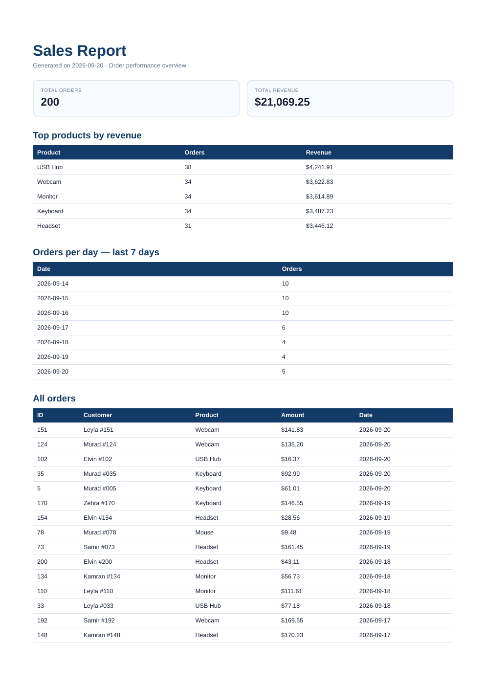

# PDF Report Generator

Bu layihə **FlyRank Backend Track — Week 4 — Assignment A8** üçün hazırlanmış PDF report generator sistemidir.

Layihənin əsas məqsədi database-də saxlanılan sifariş məlumatlarını avtomatik olaraq PDF hesabata çevirməkdir. Sistem aşağıdakı pipeline ilə işləyir:

```text
SQLite database
      ↓
SQL aggregation
      ↓
HTML report template
      ↓
Playwright + Chromium
      ↓
PDF faylı
      ↓
Diskdə saxlama
      ↓
FastAPI download linki
```

Başqa sözlə, istifadəçi `POST /reports` endpoint-inə request göndərir. Server database-dən məlumatları oxuyur, statistikaları hesablayır, HTML səhifə yaradır, həmin səhifəni PDF-ə çevirir, PDF-i diskdə saxlayır və istifadəçiyə fayl linki qaytarır.

## Tapşırığın məqsədi

Bu assignment aşağıdakı backend bacarıqlarını yoxlayır:

1. SQLite database ilə işləmək;
2. `COUNT`, `SUM`, `GROUP BY`, `ORDER BY` və `LIMIT` ilə aggregation query-ləri yazmaq;
3. SQL nəticələrindən HTML report yaratmaq;
4. Headless browser vasitəsilə HTML-i PDF-ə çevirmək;
5. Yaradılmış faylı diskdə saxlamaq;
6. API vasitəsilə faylı link ilə təqdim etmək;
7. Eyni request-in iki dəfə gəlməsi zamanı duplicate PDF yaranmasının qarşısını almaq;
8. Layihəni GitHub-da sənədləşdirilmiş şəkildə yayımlamaq.

Əsas prinsip budur:

> PDF bytes-larını JSON response-un içində daşımaq əvəzinə, PDF-i diskdə saxla və yalnız download linkini qaytar.

## İstifadə olunan texnologiyalar

| Texnologiya | İstifadə məqsədi |
|---|---|
| Python 3.10+ | Əsas proqramlaşdırma dili |
| FastAPI | REST API serveri |
| SQLite | Kiçik database və report metadata-sı |
| Playwright | Headless Chromium ilə PDF yaratmaq |
| Uvicorn | FastAPI serverini işə salmaq |
| Pytest | Avtomatlaşdırılmış testlər |
| Git/GitHub | Version control və submission |

## Dataset seçimi

Assignment iki dataset seçimi verirdi. Bu layihədə **Option A — The Little Shop** seçilib.

`seed.py` scripti:

- 200 sifariş yaradır;
- 6 fərqli məhsuldan istifadə edir;
- sifariş məbləğlərini `$5` və `$200` arasında yaradır;
- sifariş tarixlərini son 30 gün daxilində yaradır;
- `seed.py` iki dəfə işlədilsə belə, məlumatların ikiqat olmasına imkan vermir.

İstifadə olunan məhsullar:

```text
Keyboard
Mouse
Monitor
USB Hub
Webcam
Headset
```

## Layihə strukturu

```text
pdf-report-generator/
├── app.py                    # FastAPI server, SQL, HTML və PDF logic
├── seed.py                   # 200 order yaradan seed scripti
├── requirements.txt          # Python dependency-ləri
├── pytest.ini                # Pytest configuration
├── Makefile                  # Tez-tez istifadə olunan komandalar
├── SPEC.md                   # Layihənin specification sənədi
├── CHECKPOINTS.md            # Manual verification nəticələri
├── README.md                 # Bu sənəd
├── tasks/
│   ├── plan.md               # Implementasiya planı
│   └── todo.md               # Mərhələ checklist-i
├── scripts/
│   ├── report_data.py        # Aggregation nəticəsini JSON çap edir
│   └── render_report.py      # Test PDF yaradır
├── tests/
│   └── test_app.py           # Unit və API testləri
├── docs/
│   └── pdf-page-1.png        # Generated PDF-in screenshot-ı
├── reports/                  # Generated PDF-lər; Git-ə əlavə edilmir
└── report.db                 # SQLite database; Git-ə əlavə edilmir
```

`report.db` və `reports/*.pdf` generated fayllardır. Onlar `.gitignore`-a əlavə olunub. GitHub-da source code və seed recipe saxlanılır, generated data və artifacts saxlanılmır.

## Quraşdırma

### 1. Repository-ni clone et

```bash
git clone https://github.com/etikhacker/pdf-report-generator.git
cd pdf-report-generator
```

### 2. Virtual environment yarat

```bash
python3 -m venv .venv
source .venv/bin/activate
```

Windows istifadə edirsənsə:

```powershell
.venv\Scripts\activate
```

### 3. Dependency-ləri quraşdır

```bash
pip install -r requirements.txt
```

### 4. Playwright Chromium browser-ini quraşdır

```bash
playwright install chromium
```

Playwright PDF yaratmaq üçün real Chromium browser-dən istifadə edir. Bu addım edilməsə, report generation zamanı browser tapılmaya bilər.

## Database-i seed etmək

Database və cədvəllər `app.py` daxilindəki `init_db()` funksiyası ilə avtomatik yaradılır. Order məlumatlarını yaratmaq üçün:

```bash
python seed.py
```

Gözlənilən output:

```text
Seeded 200 orders into .../report.db
```

Seed script təhlükəsiz şəkildə təkrar icra oluna bilər:

```bash
python seed.py
python seed.py
```

İkinci icradan sonra database-də 400 yox, yenə də 200 order olacaq. Bunun səbəbi scriptin əvvəlcə `orders` cədvəlindəki məlumatları silməsi, sonra yeni 200 sətir əlavə etməsidir.

## Database schema

### `orders` cədvəli

```sql
CREATE TABLE orders (
    id INTEGER PRIMARY KEY AUTOINCREMENT,
    customer TEXT NOT NULL,
    product TEXT NOT NULL,
    amount REAL NOT NULL,
    created_at TEXT NOT NULL
);
```

Bu cədvəldə report üçün lazım olan bütün əsas məlumatlar saxlanılır.

### `reports` cədvəli

```sql
CREATE TABLE reports (
    id INTEGER PRIMARY KEY AUTOINCREMENT,
    path TEXT NOT NULL,
    created_at TEXT NOT NULL
);
```

Bu cədvəl yaradılmış PDF-lərin metadata-sını saxlayır. PDF-in özü database-də saxlanmır. Database-də yalnız onun path-i saxlanılır.

## SQL aggregation

Report `get_report_data()` funksiyasından alınan məlumatlarla yaradılır. Bu funksiya bir neçə SQL query istifadə edir.

### Ümumi sifariş sayı və gəlir

```sql
SELECT COUNT(*) AS total_orders,
       COALESCE(SUM(amount), 0) AS total_revenue
FROM orders;
```

Bu query iki əsas nəticə qaytarır:

- `total_orders`: bütün sifarişlərin sayı;
- `total_revenue`: bütün sifarişlərin məbləğlərinin cəmi.

### Gəlirə görə ən yaxşı 5 məhsul

```sql
SELECT product,
       COUNT(*) AS order_count,
       ROUND(SUM(amount), 2) AS revenue
FROM orders
GROUP BY product
ORDER BY revenue DESC
LIMIT 5;
```

Burada:

- `GROUP BY product` eyni məhsulları qruplaşdırır;
- `SUM(amount)` hər məhsul üzrə ümumi gəliri hesablayır;
- `ORDER BY revenue DESC` ən yüksək gəliri yuxarıya çıxarır;
- `LIMIT 5` yalnız ilk 5 məhsulu saxlayır.

### Son 7 gün üzrə sifariş sayı

```sql
SELECT created_at,
       COUNT(*) AS order_count
FROM orders
WHERE date(created_at) >= date('now', '-6 day')
GROUP BY created_at
ORDER BY created_at;
```

Bu query son 7 gündə hər tarix üzrə neçə order olduğunu hesablayır.

### PDF üçün bütün order-lar

```sql
SELECT id, customer, product, amount, created_at
FROM orders
ORDER BY created_at DESC, id DESC;
```

Bu query PDF-in aşağı hissəsində göstərilən uzun detail table üçün istifadə olunur.

Aggregation nəticəsinə baxmaq üçün:

```bash
python scripts/report_data.py
```

və ya:

```bash
make data
```

## HTML-dən PDF yaratmaq

PDF birbaşa əl ilə çəkilmir. Əvvəlcə `build_html()` funksiyası report data əsasında HTML string yaradır. HTML-in içində bunlar var:

- report başlığı;
- yaradılma tarixi;
- total orders kartı;
- total revenue kartı;
- top products table-i;
- son 7 gün table-i;
- bütün order-lar table-i.

Sonra `render_pdf()` funksiyası Playwright browser açır:

```python
async with async_playwright() as playwright:
    browser = await playwright.chromium.launch()
    page = await browser.new_page()
    await page.set_content(html)
    await page.pdf(
        path=str(path),
        format='A4',
        print_background=True
    )
    await browser.close()
```

PDF-lər `reports/` qovluğunda saxlanılır.

### Page break problemi

Uzun table-lərdə browser bir sətri iki səhifəyə bölə bilər. Bu assignment xüsusi olaraq həmin problemi həll etməyi tələb edir. Layihədə aşağıdakı print CSS istifadə olunur:

```css
thead {
    display: table-header-group;
}

tr {
    break-inside: avoid;
    page-break-inside: avoid;
}
```

Nəticə:

- table header növbəti səhifədə təkrar görünür;
- table row ortadan bölünmür;
- PDF daha oxunaqlı olur.

Test PDF yaratmaq üçün:

```bash
python scripts/render_report.py
```

və ya:

```bash
make render
```

## Serveri işə salmaq

```bash
uvicorn app:app --reload --port 8000
```

Server bu ünvanda açılır:

```text
http://localhost:8000
```

FastAPI documentation üçün:

```text
http://localhost:8000/docs
```

## API endpoint-ləri

### `GET /health`

Serverin işlədiyini yoxlayır.

Request:

```bash
curl -i http://localhost:8000/health
```

Response:

```http
HTTP/1.1 200 OK
```

```json
{
  "status": "ok"
}
```

### `POST /reports`

Yeni report yaradır. Bu endpoint aşağıdakı işləri görür:

1. Database-i yoxlayır;
2. Həmin gün üçün əvvəlki report olub-olmadığını yoxlayır;
3. Lazım olduqda SQL aggregation edir;
4. HTML yaradır;
5. Playwright ilə PDF yaradır;
6. PDF-i `reports/{id}.pdf` kimi saxlayır;
7. `reports` cədvəlinə metadata əlavə edir;
8. JSON response qaytarır.

Request:

```bash
curl -i -X POST http://localhost:8000/reports
```

Yeni report üçün response:

```http
HTTP/1.1 201 Created
```

```json
{
  "id": 1,
  "file": "/reports/1/file"
}
```

Bu endpoint qəsdən synchronously işləyir. Yəni PDF yaradılana qədər request bir neçə saniyə gözləyə bilər. Bu assignment üçün həmin davranış tələb olunur.

### `GET /reports`

Yaradılmış bütün report-ların metadata-sını göstərir.

```bash
curl -i http://localhost:8000/reports
```

Nümunə response:

```json
[
  {
    "id": 1,
    "path": "reports/1.pdf",
    "created_at": "2026-09-20T18:53:34",
    "file": "/reports/1/file"
  }
]
```

Bu endpoint assignment-ın optional control panel stretch hissəsi kimi əlavə edilib.

### `GET /reports/{id}`

Müəyyən report haqqında metadata qaytarır.

```bash
curl -i http://localhost:8000/reports/1
```

Response:

```json
{
  "id": 1,
  "path": "reports/1.pdf",
  "created_at": "2026-09-20T18:53:34",
  "file": "/reports/1/file"
}
```

Mövcud olmayan report üçün:

```text
GET /reports/999999 -> 404 Not Found
```

### `GET /reports/{id}/file`

PDF faylını diskdən yükləyir.

```bash
curl -o my-report.pdf http://localhost:8000/reports/1/file
```

Faylın PDF olduğunu yoxlamaq üçün:

```bash
file my-report.pdf
pdfinfo my-report.pdf
```

Bu endpoint üçün response content type:

```text
application/pdf
```

JSON endpoint-lər PDF bytes qaytarmır. PDF yalnız bu file endpoint-i vasitəsilə göndərilir. Bu, assignment-dakı **store and link** prinsipidir.

## Idempotency

İstifadəçi report yaratmaq düyməsinə iki dəfə basa bilər və ya network problemi səbəbindən eyni request təkrar göndərilə bilər. Sistem hər request-də yeni PDF yaratsaydı, duplicate fayllar və lazımsız browser əməliyyatları yaranardı.

Bu layihədə `POST /reports` əvvəlcə həmin gün üçün mövcud report-u yoxlayır.

Birinci request:

```bash
curl -i -X POST http://localhost:8000/reports
```

Response:

```text
201 Created
id: 1
```

İkinci request:

```bash
curl -i -X POST http://localhost:8000/reports
```

Response:

```text
200 OK
id: 1
```

İkinci request eyni `id`-ni qaytarır və yeni PDF yaratmır.

Əgər qəsdən yeni report yaratmaq lazımdırsa:

```bash
curl -i -X POST http://localhost:8000/reports \
  -H 'Content-Type: application/json' \
  -d '{"force": true}'
```

`force: true` olduqda daily idempotency yoxlaması ötürülür və yeni report yaranır.

Bu yoxlama real sistemlərdə double billing, duplicate email və eyni faylın dəfələrlə yaradılması kimi problemlərin qarşısını alır.

## Testlər

Testləri işə salmaq üçün:

```bash
pytest -q
```

və ya:

```bash
make test
```

Test suite aşağıdakı davranışları yoxlayır:

- `GET /health` 200 qaytarır;
- seed script iki dəfə işlədildikdə 200 order qalır;
- aggregation real rəqəmlər qaytarır;
- top 5 məhsul hesablanır;
- HTML-də print CSS qaydaları mövcuddur;
- real PDF yaradılır;
- PDF ən azı valid PDF bytes ilə başlayır;
- report download olunur;
- report metadata qaytarılır;
- unknown report üçün 404 qaytarılır;
- eyni gün ikinci POST eyni ID-ni qaytarır;
- `force: true` yeni ID yaradır;
- `GET /reports` siyahı qaytarır.

Yoxlanmış nəticə:

```text
5 passed
```

## Manual checkpoint

Təmiz local run zamanı alınmış nəticələr:

```text
GET /health                 -> 200 {"status":"ok"}
First POST /reports         -> 201 {"id":1,"file":"/reports/1/file"}
Second POST /reports        -> 200 {"id":1,"file":"/reports/1/file"}
SQLite order count          -> 200
SQLite report count         -> 1
Downloaded file             -> PDF document, version 1.4, 6 page(s)
Page size                   -> A4
Git commits                 -> 7 meaningful commits
```

Generated PDF-in birinci səhifəsi:



## Nə vaxt background job istifadə edilməlidir?

Bu assignment-də report generation request-in içində synchronously işlədilir. Bu, pipeline-ı sadə saxlamaq və request-in bir neçə saniyə gözlədiyini göstərmək üçün qəsdən belə hazırlanıb.

Production sistemində aşağıdakı hallarda background job-a keçmək daha doğru olar:

- PDF yaratmaq uzun çəkirsə;
- report çox böyükdürsə;
- eyni anda çoxlu istifadəçi report yaradırsa;
- HTTP request timeout riski varsa;
- istifadəçinin request cavabını gözləməsi lazım deyilsə.

Background job variantında `POST /reports` dərhal `202 Accepted` qaytarar, report isə arxa planda yaranar. `GET /reports/{id}` endpoint-i `pending` və ya `done` statusu göstərə bilər. Bu yanaşma istifadəçi üçün daha sürətli olur, lakin queue, retry, status tracking və error handling əlavə mürəkkəblik yaradır.

## Assignment tələbləri ilə uyğunluq

| Assignment tələbi | Layihədəki həll |
|---|---|
| Health endpoint | `GET /health` |
| SQLite dataset | `orders` table və 200 seeded order |
| Safe-to-run seed | `seed.py` əvvəlcə order-ları silir |
| SQL aggregation | `get_report_data()` daxilində dörd query bölməsi |
| HTML-to-PDF | `build_html()` + Playwright `page.pdf()` |
| Clean page breaks | `thead` təkrarı və `break-inside: avoid` |
| Generate report | `POST /reports` |
| Report metadata | `GET /reports/{id}` |
| File serving | `GET /reports/{id}/file` |
| Unknown ID | `404 Not Found` |
| Idempotency | Eyni gün üçün mövcud report reuse olunur |
| Force regeneration | `{ "force": true }` |
| GitHub submission | Public repository və 7 commit |
| Documentation | Bu README və PDF screenshot |

## GitHub repository

Public repository:

**https://github.com/etikhacker/pdf-report-generator**

Repository-də 7 meaningful commit mövcuddur. Generated `report.db`, PDF-lər və virtual environment Git-ə əlavə edilmir.
